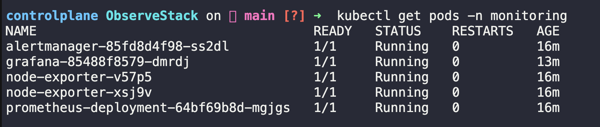
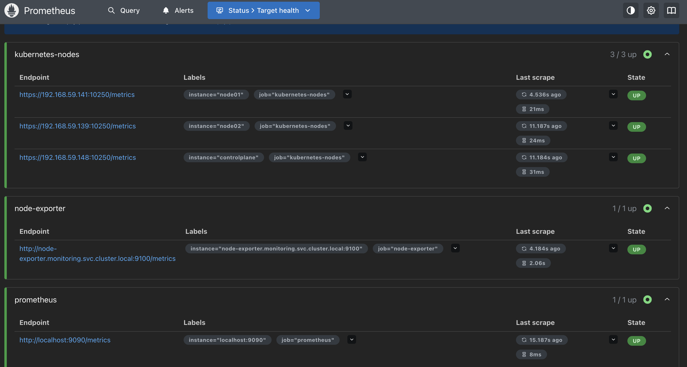
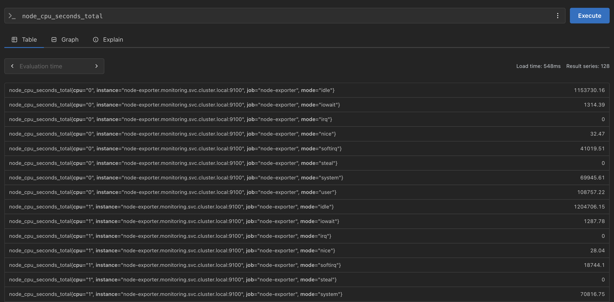
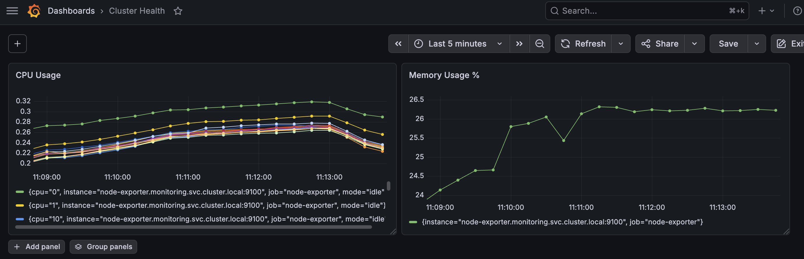
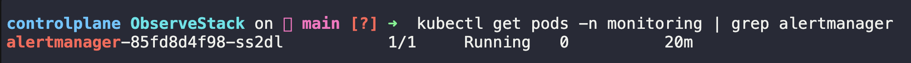

# ObserveStack

> Phase 5 Capstone — Production-grade Kubernetes observability stack using Prometheus, Grafana, and Alertmanager deployed on a multi-node cluster.

---

## Architecture

```
┌─────────────────────────────────────────────────────────────┐
│                    Kubernetes Cluster                       │
│                                                             │
│  ┌─────────────────────────────────────────────────────┐    │
│  │              monitoring namespace                   │    │
│  │                                                     │    │
│  │  ┌──────────────┐     scrapes    ┌───────────────┐  │    │
│  │  │  Prometheus  │◄───────────────│ node-exporter │  │    │
│  │  │  :9090       │  (DaemonSet)   │ :9100         │  │    │
│  │  │              │                └───────────────┘  │    │
│  │  │              │   fires alerts                    │    │
│  │  │              │───────────────►┌───────────────┐  │    │
│  │  └──────┬───────┘                │ Alertmanager  │  │    │
│  │         │ metrics                │ :9093         │  │    │
│  │         ▼                        └───────────────┘  │    │
│  │  ┌─────────────┐                                    │    │
│  │  │   Grafana   │                                    │    │
│  │  │   :3000     │                                    │    │
│  │  │   (PVC)     │                                    │    │
│  │  └─────────────┘                                    │    │
│  └─────────────────────────────────────────────────────┘    │
│                                                             │
│  ┌──────────────┐  ┌──────────────┐  ┌──────────────┐       │
│  │ controlplane │  │    node01    │  │    node02    │       │
│  └──────────────┘  └──────────────┘  └──────────────┘       │
└─────────────────────────────────────────────────────────────┘

External Access:
  Prometheus UI  →  NodePort 32090
  Grafana UI     →  NodePort 32000
```

---

## Stack

| Component | Purpose | Port |
|---|---|---|
| Prometheus | Metrics collection and alerting | 9090 (NodePort 32090) |
| Grafana | Metrics visualization | 3000 (NodePort 32000) |
| Alertmanager | Alert routing | 9093 (ClusterIP) |
| node-exporter | Node-level metrics agent | 9100 (ClusterIP) |

---

## Project Structure

```
observestack/
├── manifests/
│   ├── namespace.yaml                  # monitoring namespace
│   ├── prometheus-rbac.yaml            # ServiceAccount, ClusterRole, ClusterRoleBinding
│   ├── prometheus-configmap.yaml       # prometheus.yml + alert-rules.yml
│   ├── prometheus-deployment.yaml      # Prometheus Deployment
│   ├── prometheus-service.yaml         # NodePort :32090
│   ├── node-exporter-daemonset.yaml    # DaemonSet + ClusterIP service
│   ├── grafana-pv.yaml                 # hostPath PersistentVolume
│   ├── grafana-pvc.yaml                # PersistentVolumeClaim 1Gi
│   ├── grafana-deployment.yaml         # Grafana Deployment + NodePort :32000
│   ├── alertmanager-configmap.yaml     # alertmanager.yml routing config
│   ├── alertmanager-deployment.yaml    # Alertmanager Deployment
│   └── alertmanager-service.yaml       # ClusterIP :9093
├── dashboards/
│   └── cluster-health.json             # Exported Grafana dashboard
├── screenshots/
│   ├── 01-pods-running.png
│   ├── 02-prometheus-targets.png
│   ├── 03-node-exporter-metrics.png
│   ├── 04-grafana-datasource.png
│   ├── 05-grafana-dashboard.png
│   └── 06-alertmanager-running.png
└── README.md
```

---

## Deploy

```bash
# Clone repo
git clone https://github.com/X-Prashant-Verma/ObserveStack
cd ObserveStack

# Apply secret first (not committed to repo)
kubectl apply -f manifests/secret.yaml

# Fix Grafana volume permissions on bare cluster
ssh node01 "mkdir -p /data/grafana && chmod 777 /data/grafana"

# Deploy full stack
kubectl apply -f manifests/

# Watch pods come up
kubectl get pods -n monitoring -w
```

Expected output:
```
NAME                                    READY   STATUS    RESTARTS   AGE
alertmanager-xxxxx                      1/1     Running   0          1m
grafana-xxxxx                           1/1     Running   0          1m
node-exporter-xxxxx                     1/1     Running   0          1m
node-exporter-xxxxx                     1/1     Running   0          1m
prometheus-deployment-xxxxx             1/1     Running   0          1m
```

Access UIs:
```
Prometheus:  http://<node-ip>:32090
Grafana:     http://<node-ip>:32000
```

---

## Screenshots

### All Pods Running


### Prometheus Targets — All UP


### Node Exporter Metrics in Prometheus


### Grafana Datasource Connected


### Cluster Health Dashboard


### Alertmanager Running


---

## Challenges & Fixes

This section documents every real issue encountered during deployment and how each was resolved.

---

### 1. No StorageClass on Bare Cluster

**Problem:** `grafana-pvc` stayed in `Pending` state. The PVC requested `storageClassName: standard` but the KodeKloud playground has no dynamic storage provisioner — `kubectl get storageclass` returned nothing.

**Error:**
```
0/3 nodes are available: persistentvolumeclaim "grafana-pvc" not found
pod has unbound immediate PersistentVolumeClaims
```

**Fix:** Created a manual `hostPath` PersistentVolume (`grafana-pv.yaml`) bound directly to the PVC, and removed `storageClassName` from the PVC spec.

```yaml
# grafana-pv.yaml
apiVersion: v1
kind: PersistentVolume
metadata:
  name: grafana-pv
spec:
  capacity:
    storage: 1Gi
  accessModes:
    - ReadWriteOnce
  hostPath:
    path: /data/grafana
  claimRef:
    namespace: monitoring
    name: grafana-pvc
```

---

### 2. Grafana Volume Permission Denied

**Problem:** Grafana pod kept crashing with `CrashLoopBackOff`. Logs showed:

```
GF_PATHS_DATA='/var/lib/grafana' is not writable.
mkdir: can't create directory '/var/lib/grafana/plugins': Permission denied
```

**Root cause:** The `hostPath` directory `/data/grafana` on node01 was owned by root. Grafana runs as UID 472 and couldn't write to it. Adding `fsGroup: 472` in the pod spec didn't take effect on hostPath volumes on this cluster.

**Fix:** Manually create the directory on the node and set open permissions before deploying:

```bash
ssh node01 "mkdir -p /data/grafana && chmod 777 /data/grafana"
```

> **Note:** This is a KodeKloud-specific workaround. On managed clusters (EKS, GKE) with proper StorageClasses, a PVC would provision a volume with correct ownership automatically.

---

### 3. Prometheus Targets — 400 Bad Request on Kubelet

**Problem:** After RBAC was applied, `kubernetes-nodes` targets appeared in Prometheus but showed `400 Bad Request`.

**Root cause:** Prometheus was hitting the kubelet metrics endpoint (`port 10250`) over plain HTTP. The kubelet only accepts HTTPS.

**Fix:** Added `scheme: https`, `tls_config`, and `bearer_token_file` to the `kubernetes-nodes` scrape job:

```yaml
- job_name: 'kubernetes-nodes'
  scheme: https
  tls_config:
    insecure_skip_verify: true
  bearer_token_file: /var/run/secrets/kubernetes.io/serviceaccount/token
  kubernetes_sd_configs:
    - role: node
```

---

### 4. Prometheus Targets — 403 Forbidden on Kubelet

**Problem:** After fixing the HTTPS scheme, targets changed from `400` to `403 Forbidden`.

**Root cause:** The Prometheus ServiceAccount token was being sent but the kubelet was rejecting it. The ClusterRole was missing `nodes/metrics` and the `/metrics` nonResourceURL permission.

**Fix:** Updated `prometheus-rbac.yaml` to include:

```yaml
rules:
- apiGroups: [""]
  resources:
  - nodes
  - nodes/metrics      # ← was missing
  - pods
  - services
  - endpoints
  verbs: ["get", "list", "watch"]
- nonResourceURLs: ["/metrics"]   # ← was missing
  verbs: ["get"]
```

---

### 5. node_cpu_seconds_total Returns No Data

**Problem:** Even after all 3 nodes showed as UP in Prometheus targets, querying `node_cpu_seconds_total` returned empty results in both Prometheus and Grafana.

**Root cause:** The `kubernetes-nodes` job scrapes the kubelet on port `10250`, which exposes kubelet metrics — not node-exporter metrics. `node_cpu_seconds_total` is a node-exporter metric exposed on port `9100`. There was no scrape job pointing at node-exporter.

**Fix:** Added a dedicated `node-exporter` scrape job to `prometheus-configmap.yaml`:

```yaml
- job_name: 'node-exporter'
  static_configs:
    - targets:
      - 'node-exporter.monitoring.svc.cluster.local:9100'
```

---

### 6. Grafana Queries Using Wrong Datasource

**Problem:** When building the dashboard, all queries were tagged `(alertmanager)` instead of `(prometheus)`. Panels showed "Data source plugin does not export any Query Editor component."

**Root cause:** The default datasource in Grafana was set to Alertmanager, not Prometheus.

**Fix:** Deleted all auto-generated queries. In the query editor, manually selected `prometheus` from the datasource dropdown before entering queries.

---

### 7. PVC Stuck in Terminating

**Problem:** When trying to delete and recreate the PVC to remove `storageClassName`, the PVC got stuck in `Terminating` state indefinitely.

**Root cause:** The Grafana pod held a reference to the PVC, preventing deletion. After force-deleting the pod and the PVC, the PV was left in `Released` state — not `Available` — so it couldn't bind to the new PVC.

**Fix:** Two-step process:
```bash
# Force delete stuck PVC
kubectl delete pvc grafana-pvc -n monitoring --force --grace-period=0

# Clear claimRef on PV so it becomes Available again
kubectl patch pv grafana-pv -p '{"spec":{"claimRef": null}}'
```

---

## Key Learnings

- **RBAC is not optional** for Prometheus on Kubernetes. Even with `kubernetes_sd_configs`, Prometheus needs explicit permissions to discover and scrape cluster resources.
- **kubelet vs node-exporter** are different scrape targets. Kubelet (`10250`) exposes cluster-level metrics. node-exporter (`9100`) exposes OS-level metrics. Both are needed for full visibility.
- **hostPath volumes** on bare clusters require manual directory setup and permissions. Managed cloud clusters handle this automatically via StorageClasses.
- **Secret management:** `secret.yaml` is never committed to git. Applied manually on each cluster deployment.
